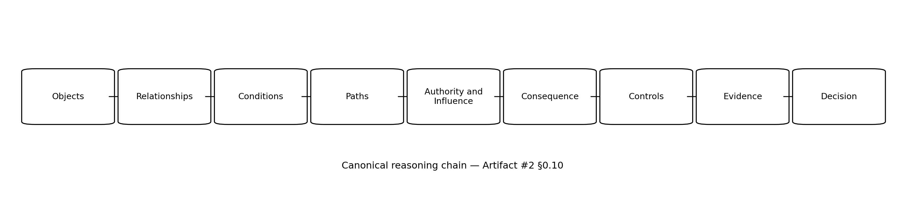
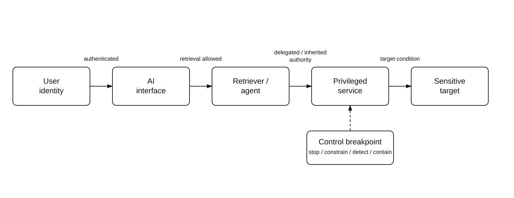
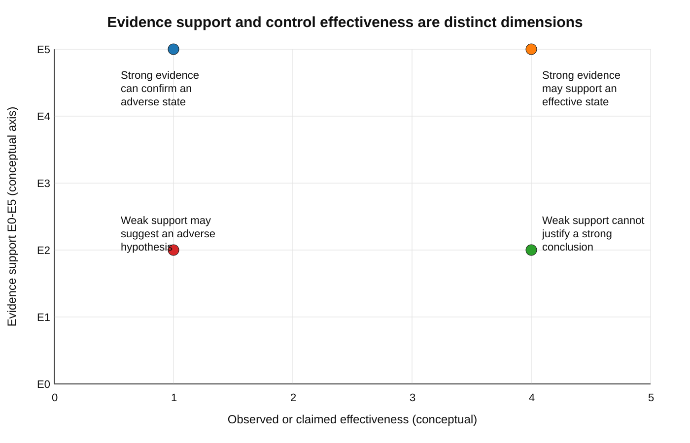
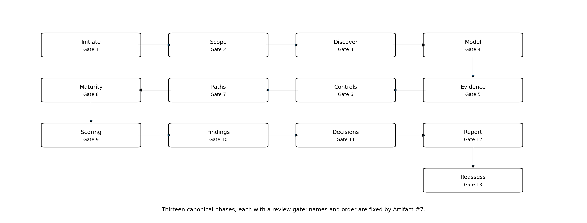
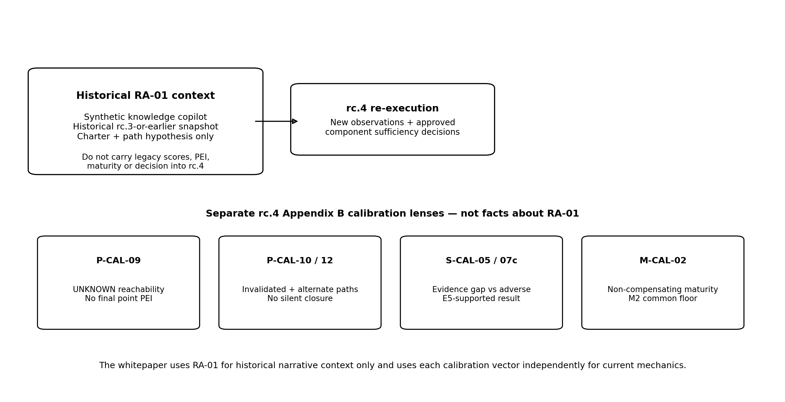

# AI Trust Graph: A Graph-Driven, Evidence-Based Methodology for AI Assurance

## Reasoning about trust, authority, paths, controls, evidence, and accountable decisions across connected AI systems

**Siva Sethumadhavan**

**Whitepaper version 1.0**
**October 2026**

**DOI:** [10.5281/zenodo.23104503](https://doi.org/10.5281/zenodo.23104503)
**Methodology baseline:** AI Trust Graph methodology bundle 1.0-rc.4 (public-release candidate), content snapshot 26 September 2026
**Manifest blob:** `79e0e15b8b2260487e2e220bb24f4d9f0ccf275a`

**How to cite:** Sethumadhavan, S. (2026). *AI Trust Graph: A Graph-Driven, Evidence-Based Methodology for AI Assurance* (Version 1.0). Zenodo. https://doi.org/10.5281/zenodo.23104503

© 2026 Siva Sethumadhavan. This whitepaper is licensed under the Creative Commons Attribution 4.0 International License (CC BY 4.0), https://creativecommons.org/licenses/by/4.0/. The licence covers the text and original figures of this paper. It does not grant rights to the "AI Trust Graph" name or any future logo or wordmark, which are reserved (see TRADEMARKS.md in the methodology repository), and it does not authorize any conformance or certification claim, which Artifact #11 governs. The paper is provided as is, without warranty.

---

# Publication status

This whitepaper is a non-normative narrative introduction to the AI Trust Graph methodology. The governed AI Trust Graph methodology artifacts maintained in the public repository remain the canonical source for definitions, controls, evidence grades, maturity rules, scoring rules, assessment procedures, reporting requirements, ontology, governance and conformance requirements. If explanatory language in this paper appears inconsistent with the canonical methodology, the governed canonical artifacts prevail.

This paper is frozen to AI Trust Graph methodology bundle 1.0-rc.4. The methodology manifest blob is `79e0e15b8b2260487e2e220bb24f4d9f0ccf275a`. That manifest pins the same thirteen artifact files as the 26 September 2026 content snapshot; it differs from the snapshot manifest only in its validation-status section, where the employer, IP and confidentiality gate moved from the pending list to the §6.1 gate record. The pin is a reproducibility reference, not a validation claim. "Version 1.0" is the version of this whitepaper; the methodology itself remains a public-release candidate.

At this baseline, the methodology author's internal review is complete. The employer, IP and confidentiality release gate is closed by the author's declaration recorded on 2 October 2026 (METHODOLOGY_MANIFEST.md §6.1): AI Trust Graph is the author's independent research, the author owns its intellectual property, and it includes no employer's or client's confidential information. That record is a self-declaration, not an external legal review. The closing approval records inside the pinned artifacts still list this gate as pending; manifest §6.1 governs current gate status until the artifacts are next revised. The following external release gates remain pending until completed and recorded through governance: independent methodology or architecture review; independent AI-security review; an inter-assessor reproducibility study using the protocol in Artifact #10 Appendix B.4; and legal approval of the licence and trademark position.

Artifact #4 §6.5 requires sensitivity analysis before public use of weighted or path formulas. An author-performed sensitivity analysis of the Path Exposure Index, the only such formula this paper presents, was completed on 2 October 2026; its method, results and limitations are published with a reproducible script [ATG-S] and summarized in §10.4. It is not an independent review, field calibration or an inter-assessor study. Whether it satisfies §6.5 and the Artifact #4 A.7 calibration criterion is for governance to decide; at the manifest pinned by this paper, no such decision is recorded.

Nothing in this paper should be interpreted as a claim that AI Trust Graph has been independently validated, academically peer reviewed, standardized, accredited or certified. It is not presented as empirically proven, universally reproducible, or proven effective in production. It does not guarantee AI safety, security, compliance or the absence of failure.

AI Trust Graph is a methodology, not a product. It is vendor-neutral and tool-independent. ExposureGraph product design, proprietary algorithms, connectors, customer data and commercial workflows are outside the public methodology and outside this whitepaper. This paper is independent research; the views are the author's own and imply no endorsement by any employer, client or cited organization. The author is also the steward of the AI Trust Graph methodology and may explore separate future implementation or commercial work; this paper makes no claim that such work is required to use the methodology.

# Abstract

AI systems increasingly operate as connected systems of identities, models, agents, tools, data, providers, workflows and human decision points. In such environments, consequential exposure can emerge from composition rather than from one component in isolation. AI Trust Graph (ATG) is an open, vendor-neutral and product-independent methodology for representing and assessing those connected relationships as a directed, labelled multigraph.

ATG follows a single canonical reasoning chain: **Objects -> Relationships -> Conditions -> Paths -> Authority and Influence -> Consequence -> Controls -> Evidence -> Decision**. It organizes assessment across six domains and seventy-two canonical controls, while keeping evidence strength, control effectiveness, maturity, path exposure and uncertainty distinct. `UNKNOWN` is preserved when evidence is absent, insufficient or materially conflicting; it is not converted into zero, pass, fail, effectiveness, Not Applicable or Not Tested.

The methodology does not produce a universal trust score. Its Path Exposure Index (PEI) may be used for triage only on determinate eligible active paths; it does not prove exploitability, probability or loss. Maturity is cumulative, evidence-gated and non-compensating rather than averaged.

This whitepaper is a non-normative narrative synthesis of methodology bundle 1.0-rc.4. It explains the graph model, trust, authority and influence, path states and roles, control breakpoints, evidence discipline, assessment lifecycle, scoring boundaries, reporting, governance and current limitations. Historical reference cases are identified as such; current scoring mechanics are illustrated only with calibration vectors explicitly evaluated under rc.4.

# Executive summary

**The problem.** AI-enabled services are rarely a model on its own. They combine identities, agents, tools, retrieval systems, data, providers, workflows and human approval points. Consequential exposure often arises from how those parts are composed: an agent acting through a privileged identity, a retriever with a broader entitlement than its user, a third-party tool reached through an approved integration, or retrieved content that steers an agent which holds authority. Component inventories, control checklists and policies each answer part of the question. None of them, on its own, shows what a connected system can actually reach, under whose authority, under which conditions, and on what evidence.

**The approach.** AI Trust Graph represents an AI-enabled environment as a directed, labelled multigraph and reasons along one canonical chain: **Objects -> Relationships -> Conditions -> Paths -> Authority and Influence -> Consequence -> Controls -> Evidence -> Decision**. Relationships are conditional assertions, not lines on a diagram. Trust (conditional reliance) is kept separate from authority (effective or permitted capacity to access, influence or change a target), and influence is recognized as the ability to affect behaviour or output without necessarily possessing formal access or execution authority. A graph connection is never treated as proof of authorization, invocation or exploitability: each path carries a validation state (PathState) and a role (PathRole), and every material condition is either supported by evidence or preserved as UNKNOWN.

**Evidence discipline.** Evidence is a governed relationship between a source and a precisely stated assertion. Evidence grades E0 to E5 describe support, not desirability: a high grade can confirm an adverse state, and a low grade cannot justify a strong favourable conclusion. Sufficiency is decided per claim, an evidence cap bounds the highest supportable component score, and UNKNOWN is never converted into zero, safe, passed, failed, effective, low risk, Not Applicable or Not Tested.

**Assessment structure.** Assessment is organized across six domains (Discovery and AIBOM; Trust and Privilege Paths; Authority Governance; AI Security Validation; AI Governance and Assurance; Operational Resilience), which are coordinated lenses over one graph and together hold seventy-two canonical controls. A thirteen-phase lifecycle from Initiate to Reassess applies a named gate at each phase. Maturity M1 to M5 is cumulative, evidence-gated and non-compensating. The methodology publishes no overall trust score. The Path Exposure Index (PEI) may be calculated for triage only on determinate eligible active paths, and it does not prove exploitability, probability or loss.

**Contribution.** The paper does not claim that graphs, attack paths, trust relationships, authorization models, evidence-supported assurance, maturity models or delegated-authority governance are new. Its proposed contribution is their governed integration within one AI-assurance methodology, so that a decision can be traced from scope and claim through evidence, graph context and control or path state to an accountable disposition.

**Appropriate uses.** The methodology is designed to support:

- a bounded decision about whether a connected AI use case may proceed, and under which conditions;
- reassessment after a material change such as a new provider, permission, model version, tool, data source or incident;
- prioritizing which material paths to validate or remediate first;
- supplying traceable evidence to broader governance, risk and security processes, including those aligned with established frameworks, without replacing them.

**Status and limitations.** This paper is a non-normative introduction; the versioned methodology artifacts remain authoritative. The methodology is a public-release candidate. Independent methodology and AI-security reviews, an inter-assessor reproducibility study and legal approval of the licence and trademark position are pending. The worked material in this paper is synthetic calibration, not field evidence. The author-performed sensitivity analysis found that small weight changes alter the PEI ordering of only a small share of path pairs, but that band membership is sensitive at band edges, which is consistent with the rule that the component profile, not the band alone, remains the authoritative explanation. AI Trust Graph is not a product, certification, regulatory standard or guarantee of security, safety or compliance.

# Research question and thesis

**Research question.** How can connected AI systems be assessed using graph-based reasoning while ensuring that assurance conclusions remain bounded by available evidence?

**This paper's thesis.** AI risk does not emerge exclusively from models. It emerges through relationships among humans, identities, agents, tools, models, data, providers, infrastructure and business systems. The thesis restates, for this paper's readers, two canonical statements. The Core Conceptual Model's central thesis is that "system assurance improves when relationships and conditions are represented with the same discipline as assets and controls" [ATG-2 §0.3], and its emergent-risk thesis states the underlying claim directly: "System risk is not equal to a simple sum of component risks. A component can satisfy its local controls and still participate in an unsafe end-to-end behavior because relationships create new reach, authority or influence" [ATG-2 §2.1].

The methodology therefore examines the connected environment as a graph while keeping explicit the distinctions the Ontology requires to remain separate [ATG-12 §2.6]:

| Distinction | Why it remains explicit |
|---|---|
| Connectivity / Authorization | Technical reachability does not confer permission. |
| Authorization / Invocation | Granted capability does not prove the action occurred. |
| Invocation / Consequence | A call does not prove successful or material effect. |
| Finding / Decision | A finding states assessed condition; a decision records accountable disposition and cannot rewrite the finding. |

The rest of the paper answers the research question in three parts: how the graph and its reasoning chain represent connected systems (§§2-6), how evidence and UNKNOWN bound what can be concluded (§§7-8), and how assessment, scoring and reporting turn those bounded conclusions into accountable decisions (§§9-12).

# 1. The assurance problem

### 1.1 Connected AI changes the unit of analysis

An AI-enabled service is rarely just a model endpoint. In a production environment, it may depend on identity federation, prompt and policy layers, retrieval systems, vector stores, memory, tool invocation, software pipelines, API gateways, model providers, data platforms and human approval workflows. An agent can also inherit the permissions of the workload or user identity under which it operates. A system that appears low-impact when viewed component by component may therefore become consequential when those components are composed.

This creates an assurance problem. A component inventory can establish what exists. A control checklist can establish whether expected safeguards are claimed or observed at individual points. A policy can define desired behaviour. None of these views, by itself, guarantees that the assessor can answer a different set of questions: What can this component reach? Through which identity? Under what authority? Across which boundary? Under what preconditions? Which control would stop, constrain, detect or contain the path? What evidence supports each step? What remains unresolved?

The AI Trust Graph methodology is designed around those questions. It does not assume that risk exists only inside a model, nor that every graph connection is dangerous. It treats material assurance as a systems problem in which the composition of relationships, permissions and dependencies can matter as much as the security posture of individual components [ATG-1][ATG-2].

### 1.2 From component posture to composed consequence

Consider an enterprise assistant that can retrieve internal documents. A conventional review may verify that the model is approved, the application is registered, authentication is enabled and the document platform has access controls. Those are useful facts. But the consequential question may be whether the assistant's retrieval path applies user-level authorization correctly for every source. If a retriever executes with a broad service entitlement, then a user who cannot directly open a restricted document may still obtain content through the assistant. The material risk emerges from a sequence: user identity -> assistant -> retriever -> inherited source entitlement -> restricted document.

The weakness is not necessarily located in the model. It may be produced by the interaction between identity, retrieval architecture, data permissions and missing validation evidence. That is exactly the kind of relationship-dependent assurance problem a graph representation is intended to make explicit.

### 1.3 Complement, not replacement

AI Trust Graph is not positioned as a substitute for established AI risk, security or management frameworks. NIST AI RMF 1.0 provides a voluntary framework for managing AI risk, and NIST's Generative AI Profile extends that work for generative-AI risks [1][2]. ISO/IEC 42001:2023 defines requirements for an AI management system, while ISO/IEC 23894:2023 provides guidance for AI risk management [3][4]. MITRE ATLAS organizes adversary tactics and techniques involving AI systems [5]. OWASP's 2026 agentic-security work addresses risks and runtime control for autonomous agents, including the Top 10 for Agentic Applications and the Agent Control Standard [6][7]. The World Economic Forum's 2026 agent playbook also emphasizes explicit authorization profiles, auditability and accountable delegated action [8].

AI Trust Graph addresses a narrower methodological question: how to represent and assess connected trust, authority and exposure relationships, link them to controls and evidence, preserve uncertainty, and produce bounded assurance conclusions. It is therefore intended to interoperate with, and provide evidence to, broader governance, risk and security processes rather than replace them.

### 1.4 Related work and differentiation

Graph-based security analysis is not new. Attack-graph research has long represented multistep compromise paths and used graph analysis to reason about defensive interventions [9][10]. Identity attack-path analysis, including BloodHound-style graph reasoning, demonstrates the value of making privilege and control paths explicit [11]. Relationship-based authorization systems such as Zanzibar show a different but relevant lineage: large-scale authorization decisions can be expressed through relationships between subjects and objects [12]. Earlier trust-management work similarly formalized trusted actions, credentials and delegated policy decisions [13], while the confused-deputy problem remains a foundational warning about exercising authority on another principal's behalf [14].

Assurance-case practice is another close intellectual relative. ISO/IEC/IEEE 15026-2:2022 specifies assurance-case structure terminology for claims, arguments and evidence, reinforcing the broader lineage of evidence-linked assurance reasoning [18]. Work critiquing weighted vulnerability indices is also relevant to PEI's explicit limitations: Spring et al. argue that CVSS severity scoring should not be treated as a risk score and question the formal and empirical justification of its scoring algorithm [19]. These precedents strengthen, rather than weaken, ATG's insistence that arithmetic remain bounded by declared semantics, evidence and decision purpose.

AI-specific work adds further adjacent concepts. Indirect prompt injection demonstrates that data can become an influence channel capable of steering an LLM-integrated application and affecting downstream tool use [15]. CycloneDX ML-BOM and the SPDX 3 AI Profile provide structured approaches to AI/ML component transparency [16][17]. The World Economic Forum's 2026 Agent Capability and Authorization Profile (ACAP) is a particularly close contemporary precedent for deployment-level authorization: it focuses on defining, enforcing and auditing what an agent is permitted to do [8]. OWASP's Agent Control Standard likewise emphasizes inspectability, traceability, middleware control hooks and runtime policy enforcement [7].

ATG does **not** claim that graphs, attack paths, trust relationships, authorization models, evidence-supported assurance, maturity models or delegated-authority governance are individually novel. Its proposed contribution is the governed integration of connected-system representation; conditions; trust; authority and influence; path reasoning; consequence; control breakpoints; evidence grading and sufficiency; explicit unresolved uncertainty; maturity; assessment execution; reporting; and accountable decision-making within one AI-assurance methodology.

This integration differs in scope from adjacent work. ACAP defines an authorization profile for an agent deployment; ATG composes authority and influence assertions with conditions into paths, then links those paths to controls, evidence, uncertainty and decisions. Relationship-based authorization answers whether a subject is authorized to access an object under a policy model; ATG uses authorization as one input to a broader assurance claim about system composition. Attack graphs focus primarily on compromise progression; ATG includes security paths but also governance, provider, data, authority, resilience and assurance relationships. These are methodological distinctions, not claims of superiority.

The relevant validation question is therefore whether the integrated method is coherent, reproducible, useful and sufficiently differentiated in practice. Those questions require independent review (including review of the author-performed sensitivity analysis), inter-assessor testing and field calibration. This paper does not treat architectural synthesis as empirical validation.

### 1.5 Assurance must remain bounded

A credible assessment has limits. Discovery may be incomplete. Provider internals may be opaque. Runtime behaviour can change. Evidence may be stale or narrow. A path may be plausible but not sufficiently evidenced. The methodology therefore rejects the idea that every assessment must end in a single definitive number.

Its governing doctrine can be summarized as: scope before collection; evidence before conclusion; conditions before path claims; tests before effectiveness; gates before averages; review before release [ATG-7]. The goal is not to manufacture certainty. It is to make the limits of certainty visible enough that decisions remain accountable.

### 1.6 The methodology's declarations

The Manifesto states ten declarations that the rest of the methodology operationalizes [ATG-1 §3]. They are reproduced here because they explain the design choices in the sections that follow.

| Declaration | Canonical statement |
|---|---|
| 1. AI security is a systems problem | We assess the complete AI-enabled operating environment, not only the foundation model or application interface. |
| 2. Trust must be represented | Trust grants, inherited privileges, delegation, dependencies and implicit assumptions must become explicit and reviewable. |
| 3. Authority must be bounded | Every agent, identity, tool and automation must have a defined action scope, approval model, lifetime and revocation path. |
| 4. Evidence must carry weight | Assertions require provenance, confidence, currency and validation state. Unknown remains Unknown. |
| 5. Paths matter more than isolated defects | Material risk is often created by combinations. Analysis must identify start conditions, traversal steps, boundary crossings, targets and controls. |
| 6. Controls must break paths | A control is valuable when it verifiably prevents, detects, constrains or contains a material path. |
| 7. Autonomy requires containment | Higher autonomy and actionability require stronger identity isolation, approvals, telemetry, rollback and kill-switch capabilities. |
| 8. Human judgment remains accountable | AI may propose relationships and findings, but material facts, risk acceptance and high-impact decisions require accountable human approval. |
| 9. Transparency outranks false precision | Scores and diagrams must expose assumptions, exclusions, stale evidence and low-confidence relationships. |
| 10. The methodology complements standards | The framework links architecture and evidence to applicable standards. It does not replace legal analysis, certification or mandated sector requirements. |

# 2. Why graph reasoning

### 2.1 Why a directed, labelled multigraph

The canonical representation is a directed, labelled multigraph [ATG-2]. Direction matters because authority, invocation, data movement and dependency are not generally symmetric. Labels matter because a connection called "can invoke" has a different assurance meaning from one called "trusts", "reads from", "delegates to" or "controlled by". Multiple edges between the same objects matter because two components may simultaneously have data, identity, trust and control relationships.

This representation allows the methodology to preserve context that is easily lost in an inventory or undifferentiated architecture diagram. A relationship is not merely a line. It is an assertion with scope, conditions, evidence and confidence. A path is not merely reachability in the mathematical sense. It is an ordered explanatory structure whose material steps and preconditions must be supported or explicitly marked unresolved.

### 2.2 The canonical reasoning chain

The Core Conceptual Model defines one reasoning chain as the intellectual spine of ATG [ATG-2 §0.10]:

**Objects -> Relationships -> Conditions -> Paths -> Authority and Influence -> Consequence -> Controls -> Evidence -> Decision**

Objects establish what exists within the system boundary. Relationships establish how those objects interact. Conditions capture the permissions, protocol, state, data, approval, timing and other prerequisites that must hold. Paths combine relationships under those conditions. Authority and influence explain who or what can cause, steer or shape an outcome; for example, content can influence without possessing authority [ATG-2 §§0.10, 1.6]. Consequence explains why the path matters. Controls identify where progression can be stopped, constrained, detected or contained. Evidence determines what the assessment can defend. Decision records the accountable disposition without changing the underlying assessed condition.

This chain is distinct from both the six-domain assessment model and the thirteen-phase lifecycle. It is not a maturity ladder, workflow sequence or scoring pipeline; it is the conceptual reasoning order used to explain an assurance claim.

### 2.3 Graph locality, systemic consequence and missing-path risk

A graph supports movement between local detail and systemic effect. A read-only retriever may appear low risk locally, yet its output can influence an agent that can invoke a consequential tool [ATG-2]. A weak approval control may sit on many paths to high-impact actions. Conversely, a visually alarming connection may not support a material claim when necessary permissions, protocols, state or other conditions are absent.

The corresponding anti-error rule is strict: a topological connection does not prove authorization, invocation or exploitability. Required conditions must be evidenced or explicitly preserved as unresolved. PathState records the strength of support for the path rather than allowing graph density to masquerade as certainty.

The inverse error is equally important: a missing represented edge or path is not evidence that no real relationship or path exists. Discovery can be incomplete, external-provider relationships can be opaque, runtime composition can change, and graph snapshots can lag the system. ATG therefore treats discovery coverage, provenance and unresolved population as part of assurance rather than assuming that an apparently clean graph proves absence of exposure.

### 2.4 Boundaries are first-class

The Core Conceptual Model defines a boundary as a first-class object representing a change in trust assumption, ownership, policy, enforcement, residency, privilege or consequence [ATG-2 §3.2]. Boundaries are therefore analytical objects rather than drawing conventions. Provider transitions, account and privilege boundaries, human-approval points, data-handling changes and responsibility transfers can all be material.

This matters in AI ecosystems because a workflow can move quickly across organizational and technical domains: a user input can influence a hosted model, that model can steer an agent, the agent can invoke a third-party tool, and the resulting action can affect an enterprise system. Making the boundary crossings explicit allows the assessor to test whether identity, authorization, evidence and control assumptions remain valid after each transition.

# 3. The AI Trust Graph model

### 3.1 Core objects and conditional relationships

The whitepaper uses a compact vocabulary while leaving the full ontology to Artifact #12. Nodes represent typed assets and assessment objects such as identities, agents, applications, tools, data resources, providers, controls, evidence objects, findings and decisions. Relationships are directional assertions. A material relationship carries endpoints, type, direction, scope, conditions, evidence, confidence, validity and review status. An edge without adequate conditions and evidence remains a candidate description rather than an approved fact [ATG-2][ATG-12].

The model therefore avoids treating an architecture line as equivalent to an assurance claim. `CAN_INVOKE`, `TRUSTS`, data movement, delegation, dependency and control coverage have different semantics even when they connect the same two objects.

### 3.2 Trust as conditional reliance

Trust is conditional reliance by one entity on another entity, assertion, output, dependency or control for a defined purpose [ATG-12]. A material trust relationship records purpose, basis, scope, owner, any explicit transitivity rule, expiry, revocation and evidence. Trust is non-transitive by default in the ontology: reliance through an intermediary is not silently inherited without explicit constraints.

### 3.3 Authority as effective or permitted capacity

Authority is the effective or permitted capacity of an actor, identity, application, agent, tool or workflow to access, influence or change a target [ATG-12]. A material authority assertion records the acting identity, capability, target, scope, conditions, duration, approval, reversibility, telemetry and revocation.

Trust and authority are distinct but interacting concepts. Trust concerns accepted reliance; authority concerns permitted or effective capacity. A trusted output need not carry authority, while an authorized component need not be trusted for every purpose. Trust relationships can nevertheless amplify effective authority or consequence when they feed downstream decision or action paths.

Authority is classified by the kind of consequence an entity can cause. The Core Conceptual Model defines eleven authority classes and states that they "are not maturity levels and should not be ranked without considering target, scope, conditions and criticality" [ATG-2 §5.2]:

| Class | Meaning | Typical concern |
|---|---|---|
| Observe | View signals, metadata or state. | Confidentiality, surveillance and inference. |
| Read | Access governed content or state. | Unauthorized disclosure or aggregation. |
| Retrieve | Select information for context or response. | Authorization context, oversharing and poisoning. |
| Infer | Derive classifications, predictions or conclusions. | Sensitive inference and unreviewed decision influence. |
| Recommend | Propose an action or decision. | Automation bias, default effect and weak review. |
| Approve | Authorize change, exception, release or transaction. | Accountability and enforceable delegation. |
| Execute | Invoke an operation or workflow. | Side effects, containment and attribution. |
| Modify | Change data, configuration, prompt, model or permission. | Integrity, change control and rollback. |
| Delete | Remove data, configuration or state. | Irreversibility, retention and recovery. |
| Disclose | Transmit information to a party or channel. | Privacy, confidentiality and purpose limitation. |
| Transact | Create binding financial, legal, safety or operational outcome. | Value limit, approval, non-repudiation and recovery. |

Each class is a separate claim. Showing that an agent can connect to a payment service does not show that it may transact; showing that it holds a grant to transact does not show that a transaction occurred; and showing that a call occurred does not show a material effect. These are the Ontology's Connectivity / Authorization, Authorization / Invocation and Invocation / Consequence distinctions [ATG-12 §2.6].

Actionability and autonomy are assessed alongside the class. "Actionability describes how directly an output can produce a state change and how much human intervention remains meaningful" [ATG-2 §5.3], and the classification is determined by effective workflow behaviour, not by a vendor label:

| Level | Actionability | Human role |
|---|---|---|
| A0 | Informational output only. | Consumes information. |
| A1 | Advisory recommendation. | Chooses whether and how to act. |
| A2 | Assisted execution with explicit confirmation. | Reviews proposed action before execution. |
| A3 | Semi-autonomous execution within bounded scope. | Sets policy, supervises and handles exceptions. |
| A4 | Autonomous execution with no normal pre-action approval. | Defines boundaries, monitors and can contain or revoke. |

These conceptual levels are distinct from the Authority component of the Path Exposure Index, which uses its own 0-4 authority-actionability scale defined in Artifact #4 §4.5.

### 3.4 Reachability, PathState and PathRole

Reachability may be Direct, Indirect, Chained, Inherited, Delegated or **Unknown** [ATG-12]. The reachability form `Unknown` is distinct from the assessment result state `UNKNOWN`.

A path records a start condition, ordered traversal, conditions, boundary crossings, target, controls, evidence and confidence, and any residual path. ATG separates two orthogonal dimensions that MUST NOT be collapsed [ATG-2 §6.3]:

| PathState | Permitted conclusion |
|---|---|
| Candidate | A hypothesized sequence requires review. |
| Topological | A traversal exists in the represented graph. |
| Plausible | Required conditions are supported or explicitly UNKNOWN. |
| Validated | Authorized testing or direct evidence confirms the scoped progression. |
| Exploitable | Evidence demonstrates a security exploit path within stated conditions. |
| Controlled | Validated controls prevent, constrain, detect or contain the path as claimed. |
| Invalidated | Evidence disproves a required step or condition. |

PathRole is separately **Primary**, **Alternate** or **Residual**. A residual or alternate path retains its own PathState. This separation prevents a controlled primary route from hiding another material route and prevents intervention status from being confused with evidentiary strength.

### 3.5 Historical integrity

Completed assessment runs are historical records. Later evidence, architectural change or remediation does not rewrite prior conclusions. New evidence creates a new or superseding state. Version discipline supports reproducibility without pretending that an earlier assessment remains current after material change.

# 4. Trust, authority, influence and material paths

### 4.1 Trust, authority and influence must remain distinguishable

Trust, authority and influence interact but are not interchangeable. A system may trust a provider output for summarization while granting the provider no authority to modify enterprise records. Conversely, an agent may possess write authority while its generated recommendation is not trusted for autonomous approval. Influence adds a third dimension: content can steer a model or agent without possessing an identity, permission grant or trusted status.

Indirect prompt injection is a concrete example. Adversarial text embedded in retrieved content can influence an LLM-integrated application and thereby shape downstream API or tool invocation [15]. In ATG terms, the content need not hold authority itself; the risk emerges when its influence is composed with the authority of the agent, tool or workload identity. This distinction is essential to AI-native path reasoning.

### 4.2 Authority amplification

Canonically, **authority amplification occurs when a path gives an entity greater effective power, reach, speed, scale or consequence than a local grant suggests** [ATG-2 §5.4]. Amplification is a system property and is not necessarily a single-component misconfiguration.

Artifact #2 identifies seven amplification lenses: **Identity amplification, Tool amplification, Data amplification, Workflow amplification, Temporal amplification, Trust amplification, and Blast-radius amplification**. These conceptual lenses should not be confused with the PEI `boundary-amplification` component, which is a specific scoring input defined by Artifact #4.

### 4.3 Delegation, inheritance and approval

"Delegation transfers bounded authority from a grantor to a delegate while preserving accountability and conditions" [ATG-2 §5.12]. The Ontology keeps a grant and a delegation distinct: "a grant confers capability; delegation transfers bounded execution authority from a grantor to a delegate" [ATG-12 §2.6]. When an agent acts on behalf of a user or another identity, the relationship is recorded so that initiator, delegate and attribution are preserved and unlimited authority is not inferred [ATG-12 §8.1].

> **ACCOUNTABILITY RULE** Delegation may transfer execution authority, but it does not erase accountable ownership of the grant or decision [ATG-2 §5.12].

Delegation is one of several ways authority reaches a target indirectly. The Core Conceptual Model distinguishes an *inherited* route, "created by role, group, workload or dependency", from a *delegated* route, "created by an explicit or implicit authority transfer" [ATG-2 §6.1]. Both are recorded separately where they depend on different conditions, and neither is assumed to pass trust or authority through an intermediary without explicit constraints. The control library makes this assessable through ATG-TRU-004 (Delegation and privilege inheritance analysis) and ATG-AUT-004 (Delegation and impersonation controls); the objective of ATG-AUT-004 is to "make delegation explicit, bounded and attributable, and prevent confused-deputy or silent privilege escalation" [ATG-5]. The confused-deputy problem [14] is the classic form of this risk; the retrieval example in §1.2 can be read as an instance of it.

Approval is a control only when it is meaningful. "Approval is meaningful only when the reviewer has sufficient information, decision freedom, competence, time and an enforceable ability to stop the action", and "an AI recommendation is not an approval" [ATG-2 §5.12]. Revocation, containment and recovery are related but distinct outcomes; high-impact authority should have "a tested revocation path, independent containment option, evidence of effect, and recovery or compensation procedure proportionate to consequence" [ATG-2 §5.13].

### 4.4 Path validation

A connection in a graph is not a validated path. A path claim must preserve the conditions under which traversal is possible: identity, permissions, protocol, state, data, approval, timing and other prerequisites. The assessor records those conditions and the evidence supporting them. Unsupported material conditions remain unresolved and constrain the PathState.

This prevents two opposite errors: assuming that every visible route is exploitable, and assuming that an unobserved route does not exist. Validation strengthens a specific scoped claim; it does not prove complete discovery of the estate.

### 4.5 Alternate and residual paths

Interventions must be evaluated against alternate and residual routes. Appendix B.2 of Artifact #10 provides current rc.4 calibration for this rule. In P-CAL-12, a primary route is Controlled at PEI 18 (Low), while an alternate route remains PEI 38 (High). The expected result is to score the alternate path separately and not conclude that the target is controlled merely because the primary route is controlled [ATG-10 B.2].

This illustrates why PathRole and PathState remain independent: controlling one route is not evidence that equivalent routes are controlled.

# 5. The six assurance domains

The canonical control library contains seventy-two controls: twelve controls in each of six domains [ATG-5]. The whitepaper does not reproduce those controls; it explains how the domains divide the assurance problem.

"The six domains are coordinated assessment lenses over one graph. They are not separate products and should not maintain incompatible definitions, evidence grades or scoring assumptions" [ATG-2 §8.1]. The Core Conceptual Model states the purpose and representative outputs of each domain:

| Domain (control prefix) | Purpose | Representative outputs |
|---|---|---|
| D1 Discovery and AIBOM (ATG-DIS) | Establish measurable estate, ownership, dependencies and shadow AI. | Asset register, AIBOM, evidence coverage, UNKNOWN backlog. |
| D2 Trust and Privilege Paths (ATG-TRU) | Model cloud and AI trust, identity inheritance and attacker-relevant paths. | Trust graph, privilege paths, boundary map, breakpoint candidates. |
| D3 Authority Governance (ATG-AUT) | Define and review effective access, inference, approval and action. | Authority matrix, approval boundaries, delegation and revocation. |
| D4 AI Security Validation (ATG-VAL) | Test architecture and controls against realistic scenarios. | Authorized tests, control state, findings and residual paths. |
| D5 AI Governance and Assurance (ATG-GOV) | Connect ownership, risk tier, policy, obligations and evidence. | Decision records, applicability, exceptions and assurance trail. |
| D6 Operational Resilience (ATG-RES) | Prepare for failure, compromise, containment and recovery. | Playbooks, kill-switch tests, rollback and recovery evidence. |

The subsections below summarize what each domain examines.

### 5.1 D1 - Discovery and AIBOM

Discovery establishes the assessed estate, ownership, dependencies, source coverage and blind spots. An AI Bill of Materials (AIBOM) supports lineage across models, data, identities, tools, runtime components and dependencies. The domain does not assume that automated discovery proves completeness. Coverage and unresolved population remain visible.

### 5.2 D2 - Trust and Privilege Paths

This domain represents trust relationships, identity and privilege paths, boundaries, provider dependencies, path conditions and graph quality. It is where the methodology asks whether a topological route is actually supported by the permissions, state and evidence required to make it material.

### 5.3 D3 - Authority Governance

Authority Governance focuses on what actors and machine entities can actually cause: action taxonomy, delegation, impersonation, least authority, approvals, amplification, resource limits, data destination authority, segregation, revocation and recertification. For agentic AI, this domain is the bridge between model behaviour and operational consequence.

### 5.4 D4 - AI Security Validation

Security Validation converts threat hypotheses into authorized testing. It covers model, prompt, context, retrieval, memory, agent, multi-agent, tool, MCP, supply-chain, runtime and control-breakpoint testing. Testing is governed by rules of engagement and safety; a technically possible test is not automatically authorized [ATG-7].

### 5.5 D5 - AI Governance and Assurance

This domain connects technical assurance to policy, risk appetite, use-case intake, impact and misuse assessment, jurisdiction and obligations, lifecycle approval, exceptions, provider due diligence, competence and independent assurance. It prevents technical controls from becoming disconnected from decision rights and business accountability.

### 5.6 D6 - Operational Resilience

Operational Resilience covers telemetry, attribution, detection, incident taxonomy, triage, containment, agent kill or pause mechanisms, credential and delegation revocation, rollback, business recovery, evidence preservation and exercises. It asks not only whether a path can be prevented, but whether the organization can detect, contain and recover when prevention fails.

### 5.7 The domains are integrated, not six silos

A material issue often crosses domains. A broad service identity may originate as a D3 authority problem, create a D2 privilege path, require D4 validation, depend on D1 inventory accuracy, trigger D5 exception governance and require D6 containment capability. The six-domain profile is therefore intended to show uneven capability without collapsing it into one number.

The integration is explicit rather than informal. "Every domain contributes objects, relationships, boundaries, controls, evidence or paths to the same versioned assessment state", and domain outputs become inputs to other domains "through explicit records rather than informal narrative transfer" [ATG-2 §8.2]:

| Integration | Required behaviour |
|---|---|
| Discovery -> all domains | Publishes coverage, ownership, AIBOM, evidence and UNKNOWNs. |
| Trust -> authority and validation | Provides relationships, boundaries and candidate paths. |
| Authority -> governance and resilience | Provides grants, action classes, approval, revocation and amplification. |
| Validation -> assurance | Provides current control and path evidence. |
| Governance -> all domains | Provides purpose, risk appetite, decisions, exceptions and obligations. |
| Resilience -> validation and governance | Provides containment, recovery, incident and rehearsal evidence. |

# 6. Control breakpoints

### 6.1 Controls as graph interventions

A control breakpoint is a node, relationship or boundary where an effective control can materially **stop, constrain, detect or contain** a path [ATG-2][ATG-12]. Breakpoint analysis asks where an intervention produces the greatest defensible reduction in material exposure while considering ownership, feasibility, independence, user impact, resilience and alternate routes.

Recovery, rollback, compensation, incident reconstruction and forensics remain important controls and resilience outcomes, particularly in D6, but they are related to rather than part of the canonical breakpoint definition. Keeping that boundary clear prevents post-event recovery capability from being described as if it had interrupted the causal path itself.

### 6.2 Design intent is not operating effectiveness

ATG distinguishes control design, implementation and operating effectiveness. A documented approval requirement can support design evidence, but it does not prove that the production workflow enforces the approval every time. A configuration export may demonstrate implementation, but an operating-effectiveness claim requires stronger evidence from current representative operation under the relevant conditions [ATG-6].

This distinction is essential for breakpoint reasoning because a path is only constrained to the extent that the breakpoint actually operates. A control drawn on an architecture diagram is not automatically a path cut.

### 6.3 Independence and concentration

Breakpoints should also be reviewed for independence. Two nominally separate controls may depend on the same identity provider, administrator or policy engine. If that common dependency fails, the graph can reveal correlated control failure. Conversely, a strategically placed independent breakpoint can reduce multiple material paths.

The purpose is not to optimize purely for the largest number of graph edges removed. Remediation must still consider consequence, feasibility, ownership, resilience and the risk of creating alternate routes.

# 7. Evidence and epistemic discipline

### 7.1 Evidence is a relationship, not a document count

The canonical Evidence Model states that evidence is a governed relationship between a source and a precisely stated assertion within defined scope, time, conditions and limitations [ATG-6]. This is a fundamental design choice. An assessment should be able to explain what was observed, how it was obtained, what the evidence supports, what it does not support, and who approved the conclusion.

The model separates evidence grade, evidence quality, assertion confidence, coverage and reviewer decision. Combining these dimensions into one score would create false certainty.

### 7.2 Evidence grades E0-E5

Evidence grade describes support for an assertion; it does not describe whether the observed state is desirable, safe, compliant or effective. **E0, No evidence:** no source is available or the supplied item cannot be linked to the assertion [ATG-6 §1.1]. The only defensible conclusion in that circumstance is UNKNOWN or Not Tested, as applicable; E0 is not evidence that a control is absent.

A separate scoring rule is equally important: absence of a linked EvidenceItem is **not itself** an E0 EvidenceItem. E0 is used only where an E0 evidence basis is explicitly recorded and reviewed under the Evidence Model [ATG-4 §1.8].

At the other end of the scale, E5 represents direct current technical evidence plus representative test or operating record within stated scope. Even E5 does not equal truth or a favourable result. A high grade can **confirm an adverse state**, while a low grade can weakly suggest a favourable state [ATG-6 §1.8].

### 7.3 Sufficiency is claim-specific

Evidence sufficient for one component claim does **not support another**. Sufficiency is decided separately for design, implementation, operating effectiveness and, where a level-5 (component score of 5) or adaptive claim is made, level-5 and adaptive operation [ATG-6 §4.1]. A finalized numeric component score requires an **approved Evidence Sufficiency Decision** and an approved reviewer decision.

The canonical minimums are claim-specific: design requires E3 or stronger; implementation, for **any score 0-5**, requires E4-or-stronger technical evidence from the deployed or configured environment; operating effectiveness requires E5-quality evidence; and a score of 5 or adaptive/continuous-assurance claim requires repeated E5-quality evidence across relevant material changes. Meeting the grade threshold is necessary but not sufficient: relevance, scope, currentness, representativeness and conflict status still govern.

### 7.4 Evidence-supported score caps

For a control **component claim**, the evidence cap is the approved evidence-support ceiling. It limits the highest component score the evidence can support; it is not an entitlement and it does not convert evidence quality into effectiveness [ATG-4 §1.8]. The rule applies equally to favourable and adverse observations.

Current rc.4 calibration makes the distinction concrete. In S-CAL-05, E3 policy/procedure evidence supports design but cannot finalize implementation; the overall remains unset and the conclusion is UNKNOWN with an Evidence Gap. In S-CAL-07c, an E5 runtime bypass test is materially relied upon for an adverse operating-effectiveness claim; the supported operating-effectiveness score is 1, the overall is 1, and the result is a Control Deficiency with Medium confidence [ATG-10 B.5]. Strong evidence can therefore confirm that a control performs poorly without being transformed into a high effectiveness score.

### 7.5 Conflict and provenance

Evidence can support, dispute, qualify, corroborate, derive from, supersede or duplicate another assertion or evidence item. Conflicting evidence remains visible until it is resolved or the conclusion is bounded. Provenance and supersession are retained so that the assessment can be reconstructed later.

This discipline is also the boundary for AI-assisted analysis. AI-generated extraction, classification or summarization may propose assertions, but model output cannot silently become approved fact. Material facts, risk acceptance and high-impact decisions require accountable human approval [ATG-1].

# 8. UNKNOWN and bounded assurance

### 8.1 UNKNOWN is a first-class state

The canonical assessment-state definition is precise: **UNKNOWN means evidence is absent, insufficient or materially conflicting** [ATG-6][ATG-12]. UNKNOWN is not zero, safe, failed, passed, effective, low risk, Not Applicable or Not Tested. It remains visible until sufficient evidence and accountable review resolve the material assertion.

UNKNOWN is also distinct from **Inconclusive**. UNKNOWN applies when the material state remains unresolved because evidence is absent, insufficient or materially conflicting. Inconclusive applies when authorized testing, review or resolution activity occurred but the evidence still cannot support a determinate conclusion [ATG-6 §0.5]. These states must not be collapsed for dashboard convenience.

The reachability form **Unknown** uses title case and answers a different question: a potentially material route lacks sufficient evidence. It must not be confused with the all-caps assessment result state `UNKNOWN`.

### 8.2 Why UNKNOWN matters for paths

Path analysis must not manufacture a number from unresolved material conditions. If an UNKNOWN condition affects **any numeric PEI component**, a final point PEI is not published. The assessor retains the affected component as UNKNOWN and may show an explicit bounded provisional range only when decision-useful [ATG-4 §§4.2, 4.8]. If a required reachability condition is disproved, the PathState becomes Invalidated and there is no active PEI.

Artifact #10 provides an rc.4 calibration vector for exactly this case. P-CAL-09 has Consequence 4, Reachability UNKNOWN, Authority 3, Amplification 2 and Control Resistance 2. The expected result is **no final point PEI**; if useful, the provisional range for R=1..4 is 38-47. P-CAL-10 then shows the opposite resolution: when the required reachability condition is disproved, the path becomes Invalidated and retains no active PEI [ATG-10 B.1].

### 8.3 Bounded assurance

This leads to a broader doctrine: assurance should be no stronger than the evidence and declared scope permit. The methodology therefore prefers a narrower, defensible statement over a broad but weak one. "Final within scope" is not the same as universal truth; it means required review and evidence gates are complete for the declared scope.

Bounded assurance is not a weakness in the methodology. It is a control against false precision. In complex AI ecosystems, the ability to state what remains unknown can be as decision-relevant as the ability to state what has been verified.

# 9. Assessment lifecycle

Artifact #7 defines thirteen canonical phases. The whitepaper preserves their names and order and summarizes the expected output without redefining the method:

| Phase | Primary outcome [ATG-7] |
|---|---|
| 1. Initiate | Approved charter and decision purpose. |
| 2. Scope | Versioned boundary and population. |
| 3. Discover | Measured estate and blind spots. |
| 4. Model | Reviewed graph snapshot. |
| 5. Evidence | Graded and traceable evidence set. |
| 6. Controls | Applicability and control results. |
| 7. Paths | Validated material path portfolio. |
| 8. Maturity | Six-domain capability profile. |
| 9. Scoring | Transparent scorecards and coverage. |
| 10. Findings | Evidence-linked gaps and remediation objectives. |
| 11. Decisions | Approved gates, exceptions and dispositions. |
| 12. Report | Quality-reviewed decision package. |
| 13. Reassess | Trigger-based new or updated run. |

The lifecycle is gate-driven. The thirteen canonical phase gates are: **Initiation gate, Scope baseline gate, Discovery gate, Graph approval gate, Evidence sufficiency gate, Control determination gate, Path conclusion gate, Maturity approval gate, Scoring quality gate, Finding release gate, Decision gate, Report release gate, and Closure and continuity gate** [ATG-7 §§2.4-14.4]. Operational entry and exit criteria remain in Artifact #7.

The lifecycle should not be read as a one-time waterfall. A new provider, permission, model version, tool, data source, control change or material incident can trigger reassessment. Historical runs remain immutable; reassessment creates a new governed state rather than rewriting the old one.

# 10. Scoring and decision discipline

### 10.1 No overall trust score

ATG intentionally does not publish a single overall AI Trust Graph score in v1.0. The current evidence base does not justify reducing trust, authority, security, governance, resilience, uncertainty and maturity into one universal number [ATG-4 §5.8]. A future composite may be proposed only after field calibration, sensitivity analysis, independent review, misuse analysis and public formula governance.

### 10.2 Maturity is cumulative and non-compensating

M1-M5 maturity is cumulative, evidence-gated and non-compensating. **A higher-level feature does not compensate for a missing lower-level foundation** [ATG-3 §1.6]. At domain level, the result is the highest common level sustained by all applicable mandatory capabilities after gate review; arithmetic averages do not replace that rule [ATG-3 §8.2].

The rc.4 calibration pair M-CAL-02 illustrates the point. D3.1 and D3.2 can be at M5 while D3.3 and D3.6 remain at M2; the domain result is M2 because advanced automation cannot compensate for the common M2 floor [ATG-10 B.3]. The preferred executive result is a six-domain vector. An overall label, if a sponsor explicitly requires one, is the minimum applicable domain level and must be accompanied by the full profile, confidence and critical gates [ATG-3 §8.3].

### 10.3 Control scoring remains evidence-bounded

Control scoring separates design, implementation and operating effectiveness and remains subject to evidence sufficiency, critical gates and compatibility rules. Numerical treatment must never convert missing support into a favourable default. An observed component state may remain visible even when the supported score is lower or absent.

### 10.4 Path Exposure Index

For triage only, PEI **may be calculated** from Consequence, Reachability, Authority, Amplification and Control Resistance:

**PEI = 4 x Consequence + 3 x Reachability + 3 x Authority + 2 x Amplification + 3 x Control Resistance**

The range is **7 to 62 for determinate eligible active paths** [ATG-4 §4.9]. The primary output is an ordinal exposure band; the component profile remains the **authoritative explanation**. PEI does **not prove exploitability, probability or loss** and is not an overall trust, certification or compliance score.

Eligibility requires a defined start condition, target, traversals, material conditions and evidence state. A Plausible path receives an exposure band only when **all numeric PEI components are determinate**. If an UNKNOWN affects a numeric component, no final point PEI is published; a provisional component profile or bounded range may be retained. An Invalidated path has no active PEI [ATG-4 §§4.2, 4.8].

Critical overrides take precedence over the arithmetic and may raise the minimum triage band where canonical override conditions apply [ATG-4 §4.10]. The arithmetic therefore never outranks the path state, critical gate or component explanation.

Before public use of weighted or path formulas, Artifact #4 requires reviewers to "test how reasonable changes in component ratings, weights and thresholds affect bands and priorities" [ATG-4 §6.5]. An author-performed sensitivity analysis of PEI was completed on 2 October 2026 over every determinate eligible active vector on the canonical scales (2,000 vectors) and over the calibration vectors of Artifact #10 Appendix B.1-B.2 [ATG-S]. Its results, which describe the arithmetic of the published formula and change no canonical rule, are:

| Test | Result |
|---|---|
| Formula recomputation (author check, not the A.7 independent recalculation) | The determinate range is exactly 7-62; every determinate Appendix B.1-B.2 calibration vector recomputes to its expected PEI and band, and P-CAL-09 to its 38-47 provisional range. P-CAL-10 has no active PEI and is a rule-level case. |
| One-point component change | Band membership is sensitive at band edges: 20.3% of single one-point moves change the band, 51.9% of vectors have at least one such move, and every vector can change band if all five components differ by one point at once. No such change can move a path by more than one band; that is an arithmetic bound (at most 15 points against at least 16 needed), not an empirical result. |
| Weight alternatives | Under each weight changed by one and under equal weights, 1.3-2.2% of all path pairs change order, at most 0.4% of cross-band pairs reverse, and the ranking correlation with the published weights (Kendall tau-b) stays between 0.913 and 0.952. Paths two or more bands apart cannot reverse under these alternatives, again by arithmetic bound. No single weight dominates: Consequence carries the largest share of PEI variance, 38.0%. |
| Threshold alternatives | Moving one band edge by one or two points re-bands 1.3-8.1% of vectors; moving all edges together re-bands 7.0-13.0%. Thresholds never change the PEI order. |
| Evidence downgrade | Confidence is not a PEI input, so a confidence downgrade cannot change Consequence; components whose descriptors are defined by evidence, such as Control Resistance 0 (Validated block), can legitimately be rescored when evidence weakens. One UNKNOWN component leaves the band indeterminate for 40% to 100% of the combinations of the other components, consistent with the rule that no final point PEI is published under UNKNOWN. |

The analysis therefore found ordering changes under the tested weight alternatives to be small, but showed that a band is not a stable classification on its own at band edges. What counts as a reasonable change and a major reversal is not defined in §6.5, so these results depend on the author's stated operational choices [ATG-S]. That is consistent with the canonical rules that the component profile remains the authoritative explanation and that bands require calibration. The analysis has clear limits: it was performed by the methodology author rather than an independent reviewer, it covers the path formula only, its input space is uniform rather than drawn from observed paths, and it cannot substitute for field calibration or the inter-assessor study. This paper therefore presents PEI as canonical methodology content for triage, not as a validated predictive instrument.

### 10.5 Decision discipline

A score is an input to judgment, not a substitute for it. A decision should preserve traceability from scope and claim through evidence, graph context, control or path state, finding and accountable disposition. Management acceptance changes disposition, not the underlying technical result.

# 11. Worked example: knowledge-copilot reasoning under rc.4

This section uses the historical RA-01 Enterprise Knowledge Copilot only as a **synthetic architecture and decision-question context**. Artifact #10 explicitly states that RA-01 to RA-12 are historical calibration snapshots authored under bundle 1.0-rc.3 or earlier. Their legacy control scores, evidence grades, confidence, findings, decisions and result states **MUST NOT** be presented as results under bundle 1.0-rc.4 or later [ATG-10 §0.16]. Accordingly, this paper does not carry forward RA-01's legacy control scores, maturity vector or point PEI as current rc.4 results.

### 11.1 Historical scenario retained only for context

RA-01 describes an advisory enterprise knowledge copilot grounded in enterprise repositories and user identity. Its historical path hypothesis is:

**User identity -> copilot -> retriever -> inherited broad source entitlement -> restricted document**

The architectural concern remains useful for teaching: a user may lack direct entitlement to a restricted document while a retrieval component operates with a broader source entitlement. The question is not merely whether a connection exists, but which conditions govern authorization, whether influence can steer retrieval, what authority is exercised, and what evidence supports each step.

### 11.2 Re-execution under rc.4 starts from conditions, not legacy scores

A current rc.4 re-execution would create new component observations and approved component-specific Evidence Sufficiency Decisions. It would not reverse-engineer the historical RA-01 score into design, implementation or operating-effectiveness components. The graph would record PathState and PathRole, preserve unresolved conditions, and evaluate the current evidence rather than inheriting historical confidence.

Artifact #10 asks: **Which conclusion changes if the weakest evidence item is removed, narrowed or contradicted?** [ATG-10 §1.10]. The answer depends on which claim that item supports.

### 11.3 Calibration lens: unresolved reachability

P-CAL-09 provides the canonical rc.4 treatment for a path whose reachability component is UNKNOWN. With C=4, R=UNKNOWN, A=3, Am=2 and CR=2, **no final point PEI is permitted**. If decision-useful, an explicit provisional range of 38-47 may be shown. UNKNOWN is not encoded as zero [ATG-10 B.1].

Applied as a teaching lens to the knowledge-copilot architecture, a missing representative authorization test could therefore constrain the reachability claim rather than being converted into an apparently precise PEI.

### 11.4 Calibration lens: disproved and alternate routes

P-CAL-10 shows the resolution case: if a required reachability condition is disproved, the PathState becomes Invalidated and there is no active PEI. P-CAL-12 then shows why one successful control does not close the analysis: a Controlled primary route at PEI 18 (Low) coexists with an alternate route at PEI 38 (High), which must be scored separately [ATG-10 B.1-B.2].

For a retrieval system, this means validating one authorization path does not establish that every provider, cache, index, tool or alternate source path enforces the same boundary.

### 11.5 Calibration lens: evidence sufficiency can support adverse conclusions

S-CAL-05 demonstrates an evidence gap. E3 design documentation is sufficient for a design claim but E3-only implementation evidence cannot finalize implementation; the control conclusion remains UNKNOWN and the finding is an Evidence Gap [ATG-10 B.5].

S-CAL-07c demonstrates the converse. An E5 representative bypass test is relied upon for an adverse operating-effectiveness claim. The supported operating-effectiveness score is 1, the overall supported result is 1, and the finding is a Control Deficiency with Medium confidence. High-grade evidence therefore **confirms the adverse state** rather than inflating the effectiveness score.

### 11.6 Calibration lens: maturity cannot average away weak foundations

M-CAL-02 provides the current non-compensation example. Several Authority Governance capabilities are at M4/M5, while approval/oversight and decision-governance capabilities remain at M2. The domain result is M2. Advanced automation and telemetry do not compensate for weak lower-level foundations [ATG-10 B.3].

### 11.7 Bounded decision logic

The worked example deliberately stops short of inventing a new rc.4 decision for RA-01. A real re-execution would require current evidence, graph state, control conclusions, gates and accountable review. The teaching outcome is instead methodological: unresolved material conditions remain visible; alternate routes remain independent; adverse evidence can support an adverse control conclusion; and advanced capability does not erase foundational gaps.

# 12. Reporting and accountable decisions

### 12.1 The graph is not the final deliverable

The purpose of an assessment is not to produce an impressive network visualization. The graph is an analytical substrate. The report must translate graph context into claims, evidence, findings and decisions without hiding scope or uncertainty.

The canonical Reporting Standard requires, among other elements, document control and assessment identity, an executive conclusion and purpose, versioned scope, method and limitations, estate and AIBOM view, trust and boundary view, authority view, control assessment, path portfolio, maturity profile, scorecards and coverage, findings, decisions, roadmap, limitations and sign-off [ATG-9 §1]. Executive reporting must disclose critical gates, coverage and residual uncertainty rather than reduce the result to a traffic light.

### 12.2 Findings remain separate from disposition

A finding records the technical or assurance condition. Management acceptance, exception or treatment records what the organization decides to do about it. Acceptance does not make the underlying condition disappear. This separation preserves technical integrity and allows future reviewers to understand whether risk changed or only its disposition changed.

### 12.3 Traceability survives to the decision

A defensible decision should be traceable back to the evidence and graph context that support it. This is particularly important for consequential AI because policy statements and high-level risk language can otherwise become disconnected from the actual system path. ATG's reporting discipline is intended to preserve the chain from observed state to accountable action.

# 13. Limitations and current validation status

### 13.1 Methodological coherence is not empirical validation

A governed methodology can be internally coherent without having demonstrated that independent assessors will apply it consistently across real organizations. The current artifact stack includes synthetic calibration material and a reproducibility protocol, but the frozen baseline explicitly records inter-assessor reproducibility validation as a pending external gate.

### 13.2 Synthetic cases are not field proof

Artifact #10 contains synthetic reference cases designed for calibration, adversarial checks and reasoning consistency. They must not be represented as observed facts about real vendors or organizations. A synthetic worked example can demonstrate how rules interact; it cannot prove predictive validity, business impact or external effectiveness.

### 13.3 Scoring has known limits

The Scoring Framework states that ordinal judgments do not become objective probabilities merely because arithmetic is applied. PEI weights and thresholds require calibration. The author-performed sensitivity analysis summarized in §10.4 found small ordering changes under the tested weight alternatives but band membership sensitive at band edges. Neither that analysis nor the synthetic calibration vectors establish predictive validity or stable cross-organization rankings, which would require field calibration and inter-assessor study.

### 13.4 Evidence and discovery have limits

The Evidence Model cannot guarantee source truth, complete discovery, legal admissibility, statistical representativeness, absence of deception or permanent currency [ATG-6]. A graph can also under-represent reality: shadow AI, undocumented identities, provider internals, runtime-created tool paths or stale discovery data can leave material relationships absent from the represented graph. Not finding a path is therefore not evidence that no path exists.

### 13.5 Dynamic and stochastic systems create additional limitations

Agentic systems can compose tool paths at runtime, registries and tool descriptions can change, providers can update models without synchronizing an assessment, and long-running agents can accumulate state across interactions. A versioned graph snapshot can bound what was represented and assessed at a point in time; it cannot guarantee that every future runtime composition is already enumerated.

Some AI controls are probabilistic rather than deterministic. Classifiers, content filters and LLM-based guardrails can have measured error rates and correlated failure modes. The current canonical methodology does not define a special mapping from probabilistic control performance to `Validated block`, Control Resistance or E5. This paper therefore identifies stochastic-control treatment as an open methodology question rather than inventing a scoring rule.

Large estates also create path-explosion and selection-bias risks. Assessor decisions about which paths are material enough for deeper validation can shape the resulting portfolio. Coverage, selection criteria and unresolved populations should therefore remain visible.

### 13.6 No guarantee of safety, compliance or certification

AI Trust Graph assessments do not guarantee future system behaviour, complete risk elimination, legal compliance or absence of failure. The governance model prohibits scores, maturity levels, conformance statements, marks, badges or future certificates from implying guaranteed safety, trustworthiness, compliance or absence of failure [ATG-11]. Version 1.0 defines certification-readiness architecture; it does not launch an accredited certification scheme.

### 13.7 Frozen validation and release status for this paper

As of the manifest pinned by this paper, the **manifest §6 external release gates** still pending are: independent methodology or architecture review; independent AI-security review; inter-assessor reproducibility study; and legal approval of the licence/trademark position. The employer/IP/confidentiality gate is closed by the author's declaration recorded in manifest §6.1, which is a self-declaration and not an external legal review; the pinned artifacts' own approval records still list it as pending, and §6.1 governs. These are not the only open readiness items across the artifact stack; specialist artifacts also contain their own validation and acceptance requirements, including independent scoring-method review. If the status changes later, this paper should remain unchanged and a new version should update the record.

The methodology author's internal review, including the sensitivity analysis in §10.4, should be understood as author-led methodology review, not independent validation.

### 13.8 Validation agenda

The next credibility step is empirical rather than rhetorical. Without changing canonical semantics, independent evaluation should test whether separate assessors reach materially consistent conclusions from the same evidence; whether path and breakpoint reasoning remains stable under realistic architectural change; whether discovery coverage and path selection remain defensible in large estates; whether PEI weights and bands remain useful under independent review of the sensitivity analysis and under field calibration; and whether resulting reports improve decision traceability without encouraging false precision [ATG-4][ATG-10].

This agenda is non-normative except where an item is already required by the canonical artifacts. In particular, sensitivity analysis before public use of weighted or path formulas is a canonical Scoring Framework requirement, not merely a research preference; an author-performed analysis has been completed for PEI; whether it satisfies §6.5 is for governance to decide, and independent review remains part of the pending scoring-method review [ATG-4 A.8].

# 14. Future research directions

The questions below are open research directions, not commitments, product plans or changes to the methodology. Any result that would alter canonical semantics would enter the methodology only through governed change (§15.2). Commercial implementations, including ExposureGraph, remain outside this paper.

### 14.1 Evidence automation within the approval boundary

Automated extraction, classification and summarization can reduce the cost of building an evidence base, but model output "creates a proposed assertion with source traceability and review state" and cannot silently become approved fact [ATG-6]. Open questions include how to measure the precision and recall of automated assertion extraction against reviewed baselines, how to preserve provenance and transformation history automatically, and how to present proposed assertions so that accountable approval remains meaningful rather than nominal.

### 14.2 Graph drift and continuous assurance

The Core Conceptual Model defines graph drift as "a material difference between that state and a later state", where the state is a versioned representation of an observed or approved graph [ATG-2 §1.9], and change, drift, incidents, remediation and expiry trigger a new or updated assessment run [ATG-7]. A continuous-assurance claim already requires repeated E5-quality evidence across relevant material changes [ATG-6]. Research is needed on drift detection that distinguishes material from immaterial change, on reassessment triggers that are neither too sparse nor too noisy, and on how continuous monitoring evidence can meet the canonical sufficiency rules without lowering them.

### 14.3 Runtime-composed and multi-agent paths

Planning agents can compose tool paths at runtime, and multi-agent systems can chain delegation and influence across several autonomous components (§13.5). An open question is how far a versioned graph snapshot can bound such behaviour, for example by assessing the permitted authority of each component rather than enumerating observed traces, and how multi-agent delegation chains should be represented and validated. This is recorded as an open methodology question; this paper does not define a new unit of analysis.

### 14.4 Probabilistic controls

Classifier-based filters and LLM-based guardrails behave probabilistically. The canonical scales define a validated block and representative E5 evidence, but not a mapping from measured error rates or correlated failure modes to those states (§13.5). Research is needed on how such controls should be tested, evidenced and expressed without converting a measured error rate into false certainty in either direction.

### 14.5 Path discovery, selection and future-state analysis at scale

Large estates can produce more candidate paths than assessors can validate. Graph analytics could help generate candidate paths, rank them for validation and detect alternate routes, provided candidates remain candidates until reviewed and topology is never treated as exploitability. The Scoring Framework already distinguishes current PEI from "future-state simulation" of a proposed control, which leaves the current PEI unchanged [ATG-4 §4.12]; tooling that supports such what-if analysis of interventions and residual paths, and methods that make path-selection criteria auditable, are open research areas.

### 14.6 Calibration and reproducibility

Beyond the pending inter-assessor study (Artifact #10 Appendix B.4), field calibration is needed to test whether PEI bands, maturity determinations and evidence-sufficiency decisions behave as intended on real assessments, and whether the band-edge sensitivity observed in the author's analysis (§10.4) should be addressed in reporting. The latter would be a governance question, not a whitepaper rule.

### 14.7 Machine-readable schemas and extensions

L4 Tool-compatible conformance remains unavailable until approved normative machine-readable schemas and conformance test vectors exist [ATG-M]. Developing those artifacts, and sector- or technology-specific extensions that preserve canonical terminology, identifiers, evidence grades, maturity semantics, scoring rules and ontology invariants [ATG-M §3], are further directions that would each require their own expert review.

# 15. Governance and methodology evolution

### 15.1 Scope-based authority

The methodology does not use a simplistic one-dimensional precedence order. The Methodology Manifest resolves authority by scope: the Manifesto governs public purpose and non-negotiable commitments; the Core Conceptual Model governs conceptual semantics; the Ontology formalizes those semantics; specialist artifacts govern maturity, scoring, controls, evidence, execution, reporting and governance within their declared authority [ATG-M].

If a conflict is detected, the affected conclusion or claim is paused, evidence and version state are preserved, and the issue is resolved through governance. The whitepaper has no authority to resolve such a conflict by reinterpretation.

### 15.2 Controlled evolution

Canonical concepts, control IDs, evidence grades, maturity semantics and scoring logic change only through governed methodology change. Published versions and completed assessments remain immutable historical records and are superseded rather than overwritten. This principle protects the methodology from silent semantic drift and allows users to reconstruct which rules were applied to a particular assessment.

### 15.3 Tool independence

The methodology can be executed with documents, spreadsheets, graph stores or compatible platforms. Tool output remains proposed until evidence, scope, method and review support acceptance. A commercial implementation may automate execution but cannot become a hidden source of canonical meaning.

Artifacts #8 and #10 provide assessor guidance and reference calibration respectively and cannot override the normative artifacts within their declared authority. Artifact #13, the Reference Graph Schema and Illustrative Query Library, is a Phase 2 non-normative companion. It carries no conformance weight at this baseline and cannot redefine the twelve core artifacts. L4 Tool-compatible conformance is explicitly unavailable until approved normative machine-readable schemas and conformance test vectors exist [ATG-M].

### 15.4 Publication boundary

This whitepaper is intentionally a front door. It synthesizes the reasoning model but does not replicate the seventy-two controls, complete M1-M5 capability matrices, full E0-E5 tables, ontology registry, scoring tables, assessor field guidance, reporting templates or implementation query library. Readers who need operational rules should use the pinned canonical artifact stack.

# Conclusion

AI assurance becomes harder when the relevant unit is no longer an isolated model but a connected system of identities, agents, tools, data, providers, workflows and human decisions. In such systems, consequential exposure can emerge through composition: conditions enable paths; authority or influence shapes what can happen; controls interrupt some routes but not necessarily alternates; and evidence determines how strongly any conclusion can be defended.

AI Trust Graph proposes a governed way to reason through that composition using its canonical chain: **Objects -> Relationships -> Conditions -> Paths -> Authority and Influence -> Consequence -> Controls -> Evidence -> Decision**. It separates trust from authority while modelling their interaction, preserves PathState and PathRole, distinguishes evidence support from effectiveness, keeps UNKNOWN visible, and uses maturity and PEI only within bounded purposes.

The methodology remains a public-release candidate at the frozen baseline. Historical calibration is not current field validation, synthetic vectors are not empirical risk observations, and several release and methodology questions remain open. Its credibility will therefore depend on independent challenge, reproducibility, independent review of the sensitivity analysis, field calibration, transparent governance and disciplined refusal to turn uncertainty into a convenient number.

Better assurance does not require pretending that every uncertainty can be scored away. It requires knowing what can be concluded, why it can be concluded, which conditions and paths the conclusion depends on, and where the evidence requires the answer to remain UNKNOWN.

# Appendix A. Whitepaper-to-canonical traceability matrix

| Whitepaper subject | Canonical authority | Semantic guardrail |
|---|---|---|
| Publication status / authority | METHODOLOGY_MANIFEST.md; #1; #11 | Non-normative paper; canonical artifacts prevail; frozen validation status |
| Assurance problem | #1; #2 | System-level reasoning; composition and path emphasis; complement existing standards |
| Graph reasoning | #2; #12 | Canonical nine-step chain; directed labelled multigraph; conditional relationships; topology is not exploitability |
| Trust | #2; #12 | Conditional reliance; purpose/basis/scope/owner/revocation/evidence; non-transitive by default |
| Declarations | #1 §3 | Ten Manifesto declarations quoted, not paraphrased |
| Research question and thesis | #2 §2.1; #12 §2.6 | Emergent-risk thesis; distinctions that must remain explicit |
| Authority | #2; #12 | Effective/permitted capacity; identity/capability/target/scope/conditions/approval/revocation |
| Authority classes and actionability | #2 §§5.2-5.3; #4 §4.5 | Eleven classes are not maturity levels; A0-A4 distinct from the PEI authority-actionability scale |
| Delegation, inheritance and approval | #2 §§5.12-5.13, §6.1; #12 §§2.6, 8.1; #5 ATG-TRU-004, ATG-AUT-004 | Bounded transfer; accountability retained; an AI recommendation is not an approval |
| Paths | #2; #4; #6; #12 | Conditions; PathState and PathRole; UNKNOWN numeric components block final point PEI; residual and alternate paths |
| Six domains | #2 §§8.1-8.2; #3; #5 | Exact canonical domain names; coordinated lenses over one graph; 12 controls per domain; do not reproduce full catalog |
| Control breakpoints | #2; #5; #12 | Stop/constrain/detect/contain; design is not operating effectiveness |
| Evidence | #6; #4 | E0-E5; grade is support not truth; sufficiency is claim-specific; evidence cap is a ceiling not an entitlement |
| UNKNOWN | #4; #6; #7; #9; #11; #12 | Evidence absent/insufficient/materially conflicting; never zero/pass/fail/effective/NA; distinct from Not Tested and Inconclusive |
| Lifecycle | #7 | Exact 13 phases: Initiate, Scope, Discover, Model, Evidence, Controls, Paths, Maturity, Scoring, Findings, Decisions, Report, Reassess |
| Maturity | #3 | M1-M5 cumulative, evidence-gated and non-compensating; no averaging |
| PEI | #4 | Exact formula and 7-62 eligible determinate range; triage only; does not prove exploitability, probability or expected loss |
| Sensitivity analysis | #4 §6.5; [ATG-S] | Author-performed; describes the published formula; changes no canonical rule; not independent review or field calibration |
| Future research | #1; #4 §4.12; #6; #7; Manifest | Open questions only; no new semantics, units of analysis or product commitments |
| Worked example | #10 | RA-01 architecture only as historical context; rc.4 mechanics use Appendix B current calibration vectors; no legacy score carry-forward |
| Reporting | #9 | No one-number trust score; disclose coverage, uncertainty, critical gates and evidence |
| Governance | #11; Manifest | Scope-based authority; historical integrity; tool independence; #13 non-normative |
| ExposureGraph boundary | #1; #2; #7; #11 | Product and proprietary implementation excluded |

# Appendix B. Glossary of canonical terms

Definitions are quoted verbatim from the artifact named in each row. Where the Core Conceptual Model, Ontology or a specialist artifact defines a term, that governing artifact is quoted; terms defined only in the Manifesto's canonical vocabulary (Appendix A) are quoted from it. This glossary adds no definition of its own.

| Term | Canonical definition | Source |
|---|---|---|
| AI asset | Any model, application, agent, prompt, retriever, vector store, model endpoint, tool, MCP service, data source, identity, pipeline, runtime or provider dependency that influences AI behavior or impact. | #1 App. A |
| Trust | Conditional reliance by one entity on another entity, assertion, output, dependency or control for a defined purpose. | #2 §4.8; #12 |
| Authority | The effective or permitted capacity of an actor, identity, application, agent, tool or workflow to access, influence or change a target. | #2 §5.1; #12 |
| Influence | The ability to affect behavior or output without necessarily possessing formal access or execution authority. | #1 App. A |
| Actionability | Actionability describes how directly an output can produce a state change and how much human intervention remains meaningful. | #2 §5.3 |
| Authority amplification | Occurs when a path gives an entity greater effective power, reach, speed, scale or consequence than a local grant suggests. | #2 §5.4 |
| Delegation | Transfers bounded authority from a grantor to a delegate while preserving accountability and conditions. | #2 §5.12 |
| Boundary | A first-class object representing a change in trust assumption, ownership, policy, enforcement, residency, privilege or consequence. | #2 §3.2 |
| Reachability | Reachability is the existence of a technically and contextually plausible route from a start condition to a target. | #2 §6.1 |
| Exposure path | An ordered sequence of evidenced or explicitly uncertain relationships by which compromise, misuse or failure can reach a material target. | #1 App. A |
| Material path | A path whose plausible outcome can exceed a defined impact, risk appetite or regulatory threshold. | #1 App. A |
| Residual path | A residual path remains after an existing or proposed intervention. | #2 §6.7 |
| Control breakpoint | A node, relationship or boundary where an effective control can materially stop, constrain, detect or contain a path. | #2 §6.6; #12 |
| Graph drift | A trust graph is a versioned representation of an observed or approved state. Graph drift is a material difference between that state and a later state. | #2 §1.9 |
| Evidence | A governed relationship between a source and a precisely stated assertion within defined scope, time, conditions and limitations. | #6 §0.3 |
| Currentness | Currentness asks whether the evidence represents the relevant assessment period and remains valid after material change. | #6 §2.4 |
| UNKNOWN | Evidence is absent, insufficient or materially conflicting. | #6 §0.5; #12 |
| Not Assessed | No assessment activity was performed for the item. | #6 §0.5 |
| Not Tested | Testing required for a stronger conclusion was not performed. | #6 §0.5 |
| Not Applicable | Approved rationale establishes that the criterion does not apply. | #6 §0.5 |
| Inconclusive | Activity occurred but cannot support a determinate conclusion. | #6 §0.5 |
| Provisional | Conclusion awaits required review or evidence closure. | #6 §0.5 |
| Final within scope | Review and evidence gates are complete for declared scope. | #6 §0.5 |

PathState values and authority classes are quoted in the tables of §3.4 and §3.3; actionability levels A0-A4 are quoted in §3.3; PathRole values are summarized in §3.4 from Artifact #2 §6.3.

# Appendix C. Artifact reference map

The governed artifacts pinned by the manifest cited on the cover, with their authority scope as stated in the Methodology Manifest and the sections of this paper that draw on them.

| # | Artifact | Version | Authority scope (Manifest §1) | Used in this paper |
|---|---|---|---|---|
| 1 | Manifesto | 1.0 | Public purpose and non-negotiable commitments | §§1, 1.6, 7.5, 14.2; App. B |
| 2 | Core Conceptual Model | 3.0.0 | Canonical conceptual semantics | Research question; §§2-6; App. B |
| 3 | Maturity Model | 1.0 | Normative maturity rules | §10.2 |
| 4 | Scoring Framework | 3.0.0 | Normative scoring rules | Publication status; §§3.3, 7.2, 7.4, 8.2, 10, 13.3, 13.8, 14.5 |
| 5 | Master Control Library | 2.0.0 | Normative control requirements | §§4.3, 5 |
| 6 | Evidence Model | 2.0.0 | Normative evidence semantics | §§7, 8, 14; App. B |
| 7 | Assessment Methodology | 1.1.0 | Normative assessment execution | §§1.5, 5.4, 9, 14.2 |
| 8 | Assessor Handbook | 1.0 | Operational assessor guidance | §15.3 |
| 9 | Reporting Standard | 1.1.0 | Normative reporting | §12 |
| 10 | Reference Assessment Repository | 2.0.0 | Illustrative and calibration material | Publication status; §§4.5, 8.2, 10.4, 11, 13.8, 14.6 |
| 11 | Governance & Certification Model | 1.0 | Governance and change control | §§13.6, 15 |
| 12 | Ontology Specification | 3.0.0 | Formal ontology representation | Research question; §§3, 4; App. B |
| 13 | Reference Graph Schema and Illustrative Query Library | 0.4.0 | Phase 2 non-normative implementation reference | §15.3 |

# References

[1] Tabassi, E. (2023). Artificial Intelligence Risk Management Framework (AI RMF 1.0). NIST AI 100-1. DOI: 10.6028/NIST.AI.100-1.
[2] Autio, C., Schwartz, R., Dunietz, J., Jain, S., Stanley, M., Tabassi, E., Hall, P., & Roberts, K. (2024). Artificial Intelligence Risk Management Framework: Generative Artificial Intelligence Profile. NIST AI 600-1. DOI: 10.6028/NIST.AI.600-1.
[3] ISO/IEC 42001:2023. Information technology - Artificial intelligence - Management system. International Organization for Standardization.
[4] ISO/IEC 23894:2023. Information technology - Artificial intelligence - Guidance on risk management. International Organization for Standardization.
[5] MITRE ATLAS. Adversarial Threat Landscape for AI Systems. https://atlas.mitre.org/
[6] OWASP GenAI Security Project. (2025). OWASP Top 10 for Agentic Applications for 2026. Released 9 December 2025. https://genai.owasp.org/resource/owasp-top-10-for-agentic-applications-for-2026/
[7] OWASP GenAI Security Project. (2026). Agent Control Standard (ACS). Resource dated 1 September 2026. https://genai.owasp.org/resource/agent-control-standard-acs/
[8] World Economic Forum. (2026). AI Agents in Action: A Playbook for Trusted Adoption, Authorization and Scaling. 26 May 2026.
[9] Swiler, L. P., Phillips, C., Ellis, D., & Chakerian, S. (1998). A graph-based network-vulnerability analysis system. Sandia National Laboratories. DOI: 10.2172/573291.
[10] Sheyner, O., Haines, J. W., Jha, S., Lippmann, R., & Wing, J. M. (2002). Automated Generation and Analysis of Attack Graphs. Proceedings of the IEEE Symposium on Security and Privacy, pp. 273-284. DOI: 10.1109/SECPRI.2002.1004377.
[11] SpecterOps. (2017). BloodHound 1.3 - The ACL Attack Path Update. https://specterops.io/blog/2017/05/15/bloodhound-1-3-the-acl-attack-path-update/
[12] Pang, R., Caceres, R., Burrows, M., Chen, Z., Dave, P., Germer, N., Golynski, A., Graney, K., Kang, N., Kissner, L., Korn, J. L., Parmar, A., Richards, C. D., & Wang, M. (2019). Zanzibar: Google's Consistent, Global Authorization System. USENIX ATC 2019, 33-46.
[13] Blaze, M., Feigenbaum, J., & Lacy, J. (1996). Decentralized Trust Management. IEEE Symposium on Security and Privacy, 164-173. DOI: 10.1109/SECPRI.1996.502679.
[14] Hardy, N. (1988). The Confused Deputy (or why capabilities might have been invented). ACM SIGOPS Operating Systems Review, 22(4), 36-38. DOI: 10.1145/54289.871709.
[15] Greshake, K., Abdelnabi, S., Mishra, S., Endres, C., Holz, T., & Fritz, M. (2023). Not what you've signed up for: Compromising Real-World LLM-Integrated Applications with Indirect Prompt Injection. arXiv:2302.12173.
[16] CycloneDX. Machine Learning Bill of Materials (ML-BOM). https://cyclonedx.org/capabilities/mlbom/
[17] SPDX. SPDX Specification 3.0.1 - AI Profile. https://spdx.github.io/spdx-spec/latest/model/AI/AI/
[18] ISO/IEC/IEEE 15026-2:2022. Systems and software engineering - Systems and software assurance - Part 2: Assurance case. International Organization for Standardization.
[19] Spring, J. M., Hatleback, E., Householder, A., Manion, A., & Shick, D. (2021). Time to Change the CVSS? IEEE Security & Privacy, 19(2), 74-78. DOI: 10.1109/MSEC.2020.3044475.
[ATG-M] AI Trust Graph Methodology Manifest, bundle 1.0-rc.4, content snapshot 2026-09-26, manifest blob 79e0e15b8b2260487e2e220bb24f4d9f0ccf275a.
[ATG-1] AI Trust Graph Artifact #1 - Manifesto, v1.0.
[ATG-2] AI Trust Graph Artifact #2 - Core Conceptual Model, v3.0.0.
[ATG-3] AI Trust Graph Artifact #3 - Maturity Model, v1.0.
[ATG-4] AI Trust Graph Artifact #4 - Scoring Framework, v3.0.0.
[ATG-5] AI Trust Graph Artifact #5 - Master Control Library, v2.0.0.
[ATG-6] AI Trust Graph Artifact #6 - Evidence Model, v2.0.0.
[ATG-7] AI Trust Graph Artifact #7 - Assessment Methodology, v1.1.0.
[ATG-8] AI Trust Graph Artifact #8 - Assessor Handbook, v1.0.
[ATG-9] AI Trust Graph Artifact #9 - Reporting Standard, v1.1.0.
[ATG-10] AI Trust Graph Artifact #10 - Reference Assessment Repository, v2.0.0.
[ATG-11] AI Trust Graph Artifact #11 - Governance & Certification Model, v1.0.
[ATG-12] AI Trust Graph Artifact #12 - Ontology Specification, v3.0.0.
[ATG-13] AI Trust Graph Artifact #13 - Reference Graph Schema and Illustrative Query Library, v0.4.0, Phase 2 non-normative companion.
[ATG-S] Sethumadhavan, S. (2026). PEI sensitivity analysis, methodology bundle 1.0-rc.4. Non-normative analysis report with reproducible script, `analysis/pei-sensitivity/` in the AI Trust Graph repository, 2 October 2026.